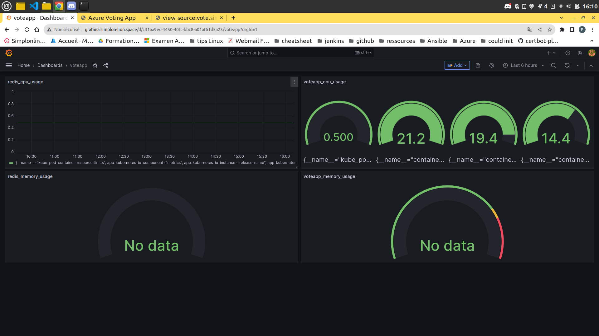
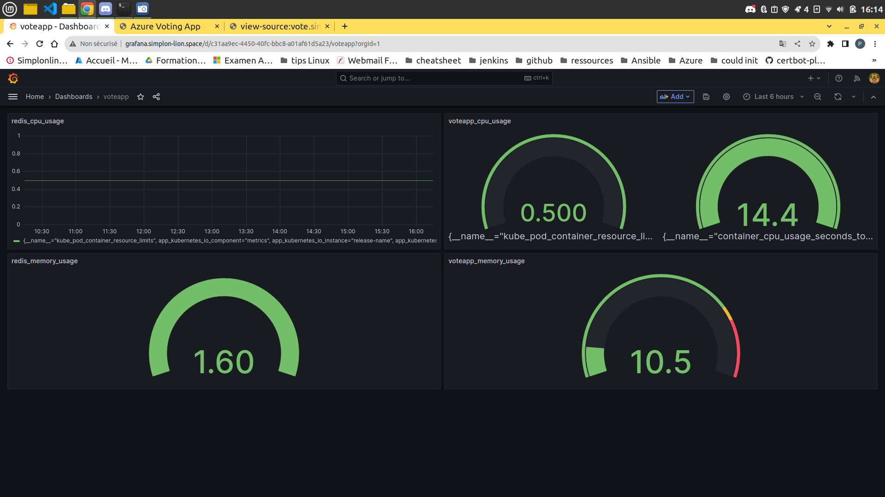

# Monitorer une voting app avec prometheus et grafana

## Initialisation et déploiement

### Déploiement du cluster

- ce placer dans le répertoire init-infra
- réaliser les commandes suivantes :
  
```hcl
terraform init
terraform plan
terraform apply

```

un cluster est déployé.

### installation de la voting app et de redis

- se placer dans le répertoire votingapp-redis
- réaliser les commandes suivantes :
  
```hcl
terraform init
terraform plan
terraform apply

```

la voting app et redis sont déployé et fonctionnels

### installation de prometheus et grafana

- se placer dans le répertoire monitor
- réaliser les commandes suivantes :
  
```hcl
terraform init
terraform plan
terraform apply

```

prometheus et grafana sont installés dans le cluster AKS et monitore la voting app et Redis

## Elements du dashboard

### Dashboard




### cpu usage

sum(rate(container_cpu_usage_seconds_total{namespace="default", pod_name="voteapp"}[5m])) * 100

sum(rate(container_cpu_usage_seconds_total{namespace="default", pod_name="redis"}[5m])) * 100

### memory en byte

container_memory_usage_bytes{namespace="default", pod_name="voteapp"}

container_memory_usage_bytes{namespace="default", pod_name="redis"}

### memory en pourcentage

sum(container_memory_usage_bytes{namespace="default", pod_name="voteapp"}) / sum(container_spec_memory_limit_bytes{namespace="default", pod_name="voteapp"}) * 100

sum(container_memory_usage_bytes{namespace="default", pod_name="redis"}) / sum(container_spec_memory_limit_bytes{namespace="default", pod_name="redis"}) * 100

### swap en byte

container_swap_usage_bytes{namespace="default", pod_name="voteapp"}

container_swap_usage_bytes{namespace="default", pod_name="redis"}
